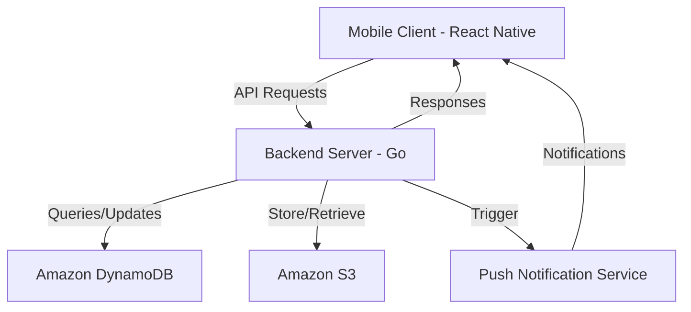
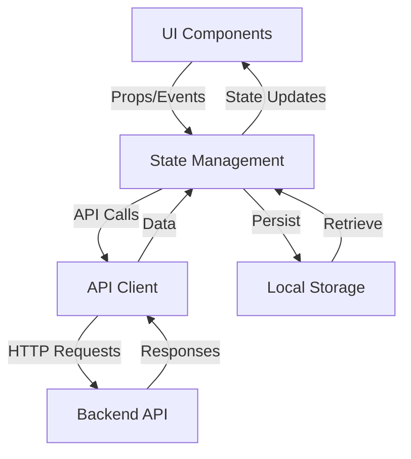
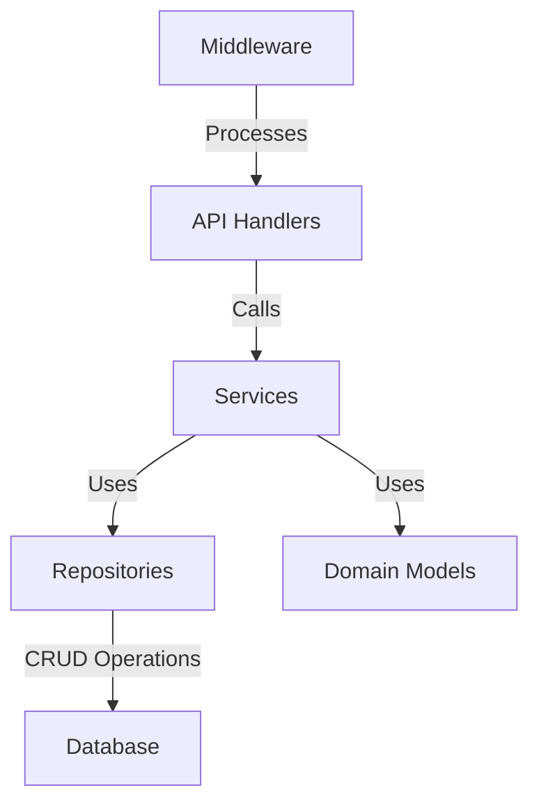

# Design Document

## Overview

Lilo is a React Native mobile application with a Go backend that provides personalized outfit recommendations and inspiration. The app focuses on delivering a delightful user experience through daily outfit suggestions, wardrobe management, and outfit reflection capabilities. This design document outlines the architecture, components, data models, and other technical aspects of the Lilo application.

## Architecture

### High-Level Architecture

Lilo follows a client-server architecture with the following main components:

1. **Mobile Client (React Native)**

   - Cross-platform mobile application for iOS and Android
   - Handles UI rendering, local state management, and user interactions
   - Communicates with the backend API for data persistence and recommendation algorithms

2. **Backend Server (Go)**

   - RESTful API for data operations
   - Handles authentication, data storage, and business logic
   - Implements recommendation algorithms for outfit suggestions
   - Manages image processing and storage

3. **Database (Amazon DynamoDB)**

   - Stores user profiles, clothing items, outfits, and user preferences
   - Maintains relationships between entities
   - Provides fast, scalable NoSQL storage

4. **Storage Service (Amazon S3)**
   - Manages storage and retrieval of images (clothing items, outfits)
   - Handles image optimization and caching
   - Provides reliable and scalable object storage



### Mobile Client Architecture

The React Native application follows a layered architecture:

1. **Presentation Layer**

   - React Native components for UI rendering
   - Navigation system for screen transitions
   - UI state management

2. **Business Logic Layer**

   - State management (Redux/Context API)
   - API client for backend communication
   - Local data caching and synchronization

3. **Data Layer**
   - Local storage for offline capabilities
   - Image caching and management
   - Synchronization logic with backend



### Backend Architecture

The Go backend follows a clean architecture approach:

1. **API Layer**

   - HTTP handlers for REST endpoints
   - Request validation and response formatting
   - Authentication middleware

2. **Service Layer**

   - Business logic implementation
   - Orchestration of data operations
   - Integration with external services

3. **Repository Layer**

   - Data access abstraction
   - Database operations
   - Caching mechanisms

4. **Domain Layer**
   - Core business entities and rules
   - Domain-specific interfaces



## Components and Interfaces

### Mobile Client Components

#### Core Screens

1. **Onboarding Screens**

   - Style preference selection
   - Weekly schedule input
   - Optional wardrobe quick-add

2. **Home Screen**

   - Daily outfit recommendation
   - Outfit details and styling tips
   - Feedback mechanisms (would wear/wouldn't wear)

3. **Explore Screen**

   - Outfit gallery with filtering options
   - Search functionality
   - Filter controls (style, season, formality, items)

4. **Wardrobe Screen**

   - Clothing item management
   - Category-based organization
   - Add/edit/delete item functionality

5. **Outfit Journal**

   - Saved outfits collection
   - Reflection history
   - Favorites section

6. **Profile & Settings**
   - User profile management
   - App preferences
   - Style profile editing

#### Key Components

1. **OutfitCard**

   - Displays outfit image and basic info
   - Provides interaction options (save, like, etc.)
   - Shows component items

2. **ClothingItemCard**

   - Displays clothing item image and details
   - Provides edit/delete options
   - Shows associated outfits

3. **FilterBar**

   - Provides filtering options for outfit browsing
   - Manages filter state
   - Displays active filters

4. **ReflectionPrompt**
   - Captures user feedback on outfits
   - Rating interface
   - Save to favorites option

### Backend API Endpoints

#### Authentication

- `POST /api/auth/signup` - Register a new user with Supabase Auth
- `POST /api/auth/signin` - Sign in with email/password or social providers
- `POST /api/auth/signout` - Sign out and invalidate session
- `GET /api/auth/user` - Get current authenticated user information
- `POST /api/auth/reset-password` - Request password reset

#### User Profile

- `GET /api/users/profile` - Get user profile
- `PUT /api/users/profile` - Update user profile
- `GET /api/users/style-profile` - Get style profile
- `PUT /api/users/style-profile` - Update style profile

#### Wardrobe Management

- `GET /api/wardrobe/items` - List clothing items
- `POST /api/wardrobe/items` - Add clothing item
- `GET /api/wardrobe/items/:id` - Get clothing item details
- `PUT /api/wardrobe/items/:id` - Update clothing item
- `DELETE /api/wardrobe/items/:id` - Delete clothing item
- `GET /api/wardrobe/categories` - List clothing categories

#### Outfit Management

- `GET /api/outfits` - List user's outfits
- `POST /api/outfits` - Create outfit
- `GET /api/outfits/:id` - Get outfit details
- `PUT /api/outfits/:id` - Update outfit
- `DELETE /api/outfits/:id` - Delete outfit
- `POST /api/outfits/:id/favorite` - Add outfit to favorites
- `DELETE /api/outfits/:id/favorite` - Remove outfit from favorites

#### Recommendations

- `GET /api/recommendations/daily` - Get daily outfit recommendation
- `GET /api/recommendations/explore` - Get outfit recommendations for explore page
- `POST /api/recommendations/feedback` - Submit feedback on recommendation

#### Reflection

- `POST /api/reflections` - Submit outfit reflection
- `GET /api/reflections` - Get reflection history
- `GET /api/reflections/insights` - Get insights from reflections

#### Wishlist

- `GET /api/wishlist` - Get wishlist items
- `POST /api/wishlist` - Add item to wishlist
- `DELETE /api/wishlist/:id` - Remove item from wishlist

## Data Models

### User

```go
type User struct {
    ID            string    `json:"id"`
    SupabaseID    string    `json:"supabase_id"`
    Email         string    `json:"email"`
    Name          string    `json:"name"`
    Picture       string    `json:"picture"`
    CreatedAt     time.Time `json:"created_at"`
    UpdatedAt     time.Time `json:"updated_at"`
    StyleProfile  StyleProfile `json:"style_profile"`
}
```

### StyleProfile

```go
type StyleProfile struct {
    ID            string   `json:"id"`
    UserID        string   `json:"user_id"`
    PreferredStyles []string `json:"preferred_styles"`
    WeeklySchedule WeeklySchedule `json:"weekly_schedule"`
    SeasonalPreferences map[string][]string `json:"seasonal_preferences"`
    ColorPreferences    []string `json:"color_preferences"`
    UpdatedAt     time.Time `json:"updated_at"`
}

type WeeklySchedule struct {
    Monday    DayType `json:"monday"`
    Tuesday   DayType `json:"tuesday"`
    Wednesday DayType `json:"wednesday"`
    Thursday  DayType `json:"thursday"`
    Friday    DayType `json:"friday"`
    Saturday  DayType `json:"saturday"`
    Sunday    DayType `json:"sunday"`
}

type DayType string // e.g., "casual", "professional", "formal", etc.
```

### ClothingItem

```go
type ClothingItem struct {
    ID          string    `json:"id"`
    UserID      string    `json:"user_id"`
    Name        string    `json:"name"`
    Category    string    `json:"category"`
    Subcategory string    `json:"subcategory"`
    Color       string    `json:"color"`
    Season      []string  `json:"season"` // e.g., ["summer", "spring"]
    Brand       string    `json:"brand"`
    Size        string    `json:"size"`
    ImageURLs   []string  `json:"image_urls"`
    IsOwned     bool      `json:"is_owned"` // true for owned, false for wishlist
    CreatedAt   time.Time `json:"created_at"`
    UpdatedAt   time.Time `json:"updated_at"`
}
```

### Outfit

```go
type Outfit struct {
    ID           string       `json:"id"`
    UserID       string       `json:"user_id"`
    Name         string       `json:"name"`
    Description  string       `json:"description"`
    Items        []string     `json:"items"` // IDs of clothing items
    Occasion     []string     `json:"occasion"`
    Season       []string     `json:"season"`
    ImageURL     string       `json:"image_url"`
    IsRecommended bool        `json:"is_recommended"`
    IsFavorite   bool        `json:"is_favorite"`
    CreatedAt    time.Time    `json:"created_at"`
    UpdatedAt    time.Time    `json:"updated_at"`
}
```

### Reflection

```go
type Reflection struct {
    ID           string    `json:"id"`
    UserID       string    `json:"user_id"`
    OutfitID     string    `json:"outfit_id"`
    Date         time.Time `json:"date"`
    Confidence   int       `json:"confidence"` // 1-5 scale
    Comfort      int       `json:"comfort"`    // 1-5 scale
    WouldRewear  bool      `json:"would_rewear"`
    Notes        string    `json:"notes"`
    CreatedAt    time.Time `json:"created_at"`
}
```

### Recommendation

```go
type Recommendation struct {
    ID           string    `json:"id"`
    UserID       string    `json:"user_id"`
    OutfitID     string    `json:"outfit_id"`
    Date         time.Time `json:"date"`
    Feedback     string    `json:"feedback"` // "liked", "disliked", "neutral"
    Reason       string    `json:"reason"`   // Why this was recommended
    StylingTips  []string  `json:"styling_tips"`
    CreatedAt    time.Time `json:"created_at"`
}
```

## Error Handling

### Mobile Client Error Handling

1. **Network Errors**

   - Detect connectivity issues
   - Provide offline mode when possible
   - Retry mechanisms for failed requests
   - Clear user feedback for network-related issues

2. **API Errors**

   - Parse error responses from the backend
   - Display appropriate error messages
   - Implement graceful degradation

3. **UI Error Boundaries**
   - Prevent complete app crashes
   - Isolate errors to specific components
   - Provide recovery options

### Backend Error Handling

1. **Request Validation**

   - Validate all incoming requests
   - Return descriptive validation errors
   - Use appropriate HTTP status codes

2. **Business Logic Errors**

   - Define domain-specific error types
   - Return meaningful error messages
   - Log detailed error information

3. **Database Errors**

   - Handle connection issues
   - Implement retry mechanisms
   - Provide fallback options when possible

4. **External Service Errors**
   - Handle timeouts and failures
   - Implement circuit breakers
   - Use fallback mechanisms

## Testing Strategy

### Mobile Client Testing

1. **Unit Testing**

   - Test individual components
   - Test utility functions
   - Test state management logic

2. **Integration Testing**

   - Test component interactions
   - Test navigation flows
   - Test API integration

3. **End-to-End Testing**

   - Test complete user flows
   - Test on actual devices
   - Test offline capabilities

4. **Visual Testing**
   - Test UI appearance
   - Test responsive layouts
   - Test animations and transitions

### Backend Testing

1. **Unit Testing**

   - Test individual functions
   - Test business logic
   - Test validation rules

2. **Integration Testing**

   - Test API endpoints
   - Test database interactions
   - Test external service integrations

3. **Performance Testing**

   - Test API response times
   - Test under load
   - Test recommendation algorithm performance

4. **Security Testing**
   - Test authentication and authorization
   - Test input validation
   - Test for common vulnerabilities

## Security Considerations

1. **Authentication and Authorization**

   - Supabase Auth integration for secure authentication
   - JWT token validation
   - Role-based access control
   - Session management

2. **Data Protection**

   - Encryption of sensitive data
   - HTTPS for all API communications
   - Secure storage of user credentials
   - Privacy-focused data handling

3. **Input Validation**

   - Validate all user inputs
   - Prevent injection attacks
   - Sanitize data before storage

4. **API Security**
   - Rate limiting
   - CORS configuration
   - API key management
   - Request validation

## Performance Optimization

### Mobile Client Optimization

1. **Image Optimization**

   - Lazy loading of images
   - Image caching
   - Responsive image sizing
   - Progressive image loading

2. **State Management**

   - Efficient state updates
   - Memoization of expensive calculations
   - Optimized re-renders

3. **Network Optimization**
   - Request batching
   - Data prefetching
   - Incremental loading

### Backend Optimization

1. **Database Optimization**

   - Efficient query design
   - Appropriate indexing
   - Connection pooling
   - Query caching

2. **API Optimization**

   - Response compression
   - Pagination for large datasets
   - Partial responses
   - Caching strategies

3. **Recommendation Algorithm Optimization**
   - Efficient algorithm implementation
   - Background processing for intensive calculations
   - Caching of recommendation results
   - Incremental updates to recommendation models

## Deployment Strategy

1. **Mobile Client Deployment**

   - CI/CD pipeline for builds
   - Beta testing through TestFlight/Google Play Beta
   - Phased rollout for production releases
   - Feature flags for gradual feature introduction

2. **Backend Deployment**

   - Containerized deployment (Docker)
   - Kubernetes for orchestration
   - Blue-green deployment strategy
   - Automated rollbacks

3. **Database Deployment (DynamoDB)**

   - Utilize Amazon DynamoDB as managed NoSQL database service
   - Configure automatic backups with AWS Backup
   - Enable point-in-time recovery for data protection
   - Implement DynamoDB Auto Scaling for handling varying workloads

4. **Monitoring and Logging**
   - Centralized logging
   - Performance monitoring
   - Error tracking
   - User analytics

## Future Considerations

1. **Scalability**

   - Horizontal scaling of backend services
   - Sharding strategies for database
   - CDN integration for static assets
   - Microservices architecture evolution

2. **Feature Expansion**

   - Social sharing capabilities
   - Integration with fashion retailers
   - AR try-on features
   - Seasonal trend analysis

3. **AI/ML Enhancements**

   - Advanced outfit recommendation algorithms
   - Style trend prediction
   - Image recognition for automatic item categorization
   - Personalized styling advice

4. **Platform Expansion**
   - Web application
   - Wearable device integration
   - Smart home integration (e.g., smart mirrors)
   - Voice assistant integration
